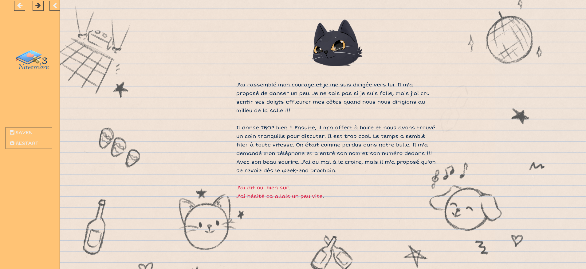

# Le 3 novembre: une experience fictionnelle interactive
Ce projet a été développé dans le cadre du cours "Jeu vidéo 2d" dispensé par Isaac Pante (SLI, Lettres, UNIL) durant le semstre de printemps 2022.

## Description
Cette fiction interactive se place dans la continuité du programme de prévention "sortir ensemble et se respecter" promulgué dans les classes vaudoises et valaisannes du secondaire. 

Mon but est d'utiliser la mécanique du choix (ou du non choix) pour mettre en emphase l'emprises vécues par les victimes. 

Les joueur.euses vont jouer la relation d'une adolescente pour expérimenter différentes situations de violence fictionnelles, en faisant le lien avec la classification de couleur créée par le programme de prévention. 

Cette fiction interactive est tiré de faits réels et basée sur l'expérience de survivantes de violences récoltés grâce à des entretients biographiques et dans une perspective sociologique. 

Après des testes avec une conseillère en planning familial j'ai généralisé les situations décrites. Cela permet au prjet d'être utilisé dans le cadre des atliers pédagogiques.

## Inspiration
La direction artistique de se projet s'inspire du jeu de rôle "Donjon et chaton" et le travail de son illustrateur Clément De Ruyter.

## Outils utilisés 
Ce jeu/fiction interactive est créée grâce au logiciel twine 2 dans le format Sugarcube 2.3.
Les images sont dessinées sur Procreate.

## Interface
Les joueur.euses lisent et cliquent sur des liens pour faire des choix. La barre de gauche permet au jeu de revenir en arrières. 

## fichier sous droit d'auteur
Paging through book by Aurelon -- https://freesound.org/s/677129/ -- License: Creative Commons 0

## Autrice
Camille Steger-Pellerin

## Remerciement
Remercîments à Isaac Pante pour son enseignement de qualité.
Mais aussi à mes amies Joana et Léa pour avoir testé mon jeu et à Imelda conseillère au planning familial qui m'a aidé et dirigé dans ma démarche.
Enfin merci milles fois à J. et A. pour m'avoir confié leur histoire et à Imelda pour ses renseignements. 
